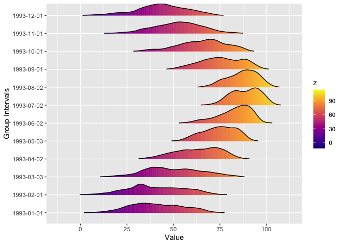
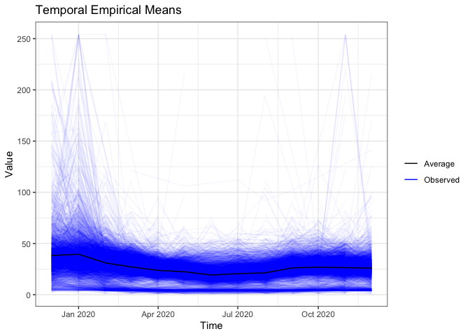
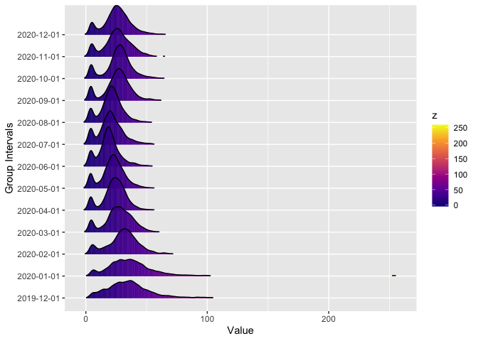

<!-- README.md is generated from README.Rmd. Please edit that file -->

# stxplore

<!-- badges: start -->

[](https://github.com/sevvandi/stxplore/actions/workflows/R-CMD-check.yaml)
<!-- badges: end -->

The goal of stxplore is to explore spatio-temporal data. It can take in
either dataframes or stars objects. It is a tool for exploratory data
analysis.

## Installation

You can install the development version of stxplore from
[GitHub](https://github.com/) with:

``` r
# install.packages("devtools")
devtools::install_github("sevvandi/stxplore")
```

## A quick introduction

Let’s first explore some spatio-temporal data using dataframes. The
dataset NOAA_df_1990 has temperature and precipitation for from 1990 to
1993 for selected locations.

``` r
library(stxplore)
library(dplyr)
#> 
#> Attaching package: 'dplyr'
#> The following objects are masked from 'package:stats':
#> 
#>     filter, lag
#> The following objects are masked from 'package:base':
#> 
#>     intersect, setdiff, setequal, union

data("NOAA_df_1990")

precip <- filter(NOAA_df_1990,
  proc == "Precip" &
  year == 1993)
precip$t <- precip$julian - min(precip$julian) + 1
head(precip)
#>   julian year month day   id    z   proc   lat       lon       date t
#> 1 727930 1993     1   1 3804 0.00 Precip 39.35 -81.43333 1993-01-01 1
#> 2 727931 1993     1   2 3804 0.00 Precip 39.35 -81.43333 1993-01-02 2
#> 3 727932 1993     1   3 3804 0.03 Precip 39.35 -81.43333 1993-01-03 3
#> 4 727933 1993     1   4 3804 0.37 Precip 39.35 -81.43333 1993-01-04 4
#> 5 727934 1993     1   5 3804 0.09 Precip 39.35 -81.43333 1993-01-05 5
#> 6 727935 1993     1   6 3804 0.00 Precip 39.35 -81.43333 1993-01-06 6
```

The z variable has precipitation in this in dataset. Let’s visualize the
mean precipitation over time.

``` r

tem <- temporal_means(precip,
                      t_col = 'date',
                      z_col = 'z',
                      id_col = 'id')

autoplot(tem,
         ylab = "Mean Precipitation")
```

 Let’s look
at minimum temperature. Let’s first subset the dataset.

``` r
tmin <- filter(NOAA_df_1990,
  proc == "Tmin" &
  year == 1993)
```

Ridgeline plots break up the quantity of interest into several groups
and shows its distribution. We use the R package *ggridges* (Wilke 2021)
underneath. In this Ridgeline plot we see how the minimum temperature
for higher latitudes is lower.

``` r
ridgeline(tmin, group_col = 'lat', z_col = 'z')
#> Warning: `stat(x)` was deprecated in ggplot2 3.4.0.
#> ℹ Please use `after_stat(x)` instead.
#> ℹ The deprecated feature was likely used in the stxplore package.
#>   Please report the issue to the authors.
#> Picking joint bandwidth of 3.27
```


Of course if we group by longitude, there wouldn’t be much difference
between the groups. What about the difference over time? Can we see that
using Ridgeline plots?

``` r
ridgeline(tmin, group_col = 'date', z_col = 'z', num_grps = 12)
#> Picking joint bandwidth of 1.99
```



## Moving on to stars objects

The stars dataset aerosol_australia has aerosol optical thickness over
Australia and surrounds for 13 months starting from 2019 December to
2020 December. There were devastating bushfires in Australia during this
time. The data was taken from NASA Earth Observations (NEO) website
<https://neo.gsfc.nasa.gov> (“NASA Earth Observations (NEO),” n.d.).

``` r
data("aerosol_australia")

aerosol_australia
#> stars object with 3 dimensions and 1 attribute
#> attribute(s):
#>                    Min. 1st Qu. Median     Mean 3rd Qu. Max.  NA's
#> aerosol_thickness     1      19     26 27.06014      33  254 13585
#> dimension(s):
#>      from to offset delta refsys point                    values x/y
#> x       1 70    110     1 WGS 84 FALSE                      NULL [x]
#> y       1 70      0    -1 WGS 84 FALSE                      NULL [y]
#> date    1 13     NA    NA   Date    NA 2019-12-01,...,2020-12-01

temp_means <- temporal_means(aerosol_australia)
autoplot(temp_means)
#> Warning: Removed 6513 rows containing missing values (`geom_line()`).
```



``` r

ridgeline(aerosol_australia, group_dim = 3, num_grps = 13)
#> Picking joint bandwidth of 1.72
```



We can see that during December and January there aerosols were much
higher compared to other months.

## The making of stxplore

In 2017, Chris Wikle and Petra Kunhert taught a short course titled *An
Introduction to Statistics for Spatio-Temporal Data*. The course was
based on two books:

1.  Statistics for Spatio-Temporal Data by Noel Cressie and
    Christopher K. Wikle (Cressie and Wikle 2015)
2.  Spatio-Temporal Statistics with R by Christopher K. Wikle, Andrew
    Zammit-Mangion and Noel Cressie (Wikle, Zammit-Mangion, and Cressie
    2019)

There had been some discussions in making a separate package for
spatio-temporal exploration. Even though there are many packages for
spatio-temporal modelling, exploration is rarely given the spotlight.
Many years later, Petra mentioned this to me and I’ve been involved in
making it a reality.

## References

<div id="refs" class="references csl-bib-body hanging-indent">

<div id="ref-cressie2015statistics" class="csl-entry">

Cressie, Noel, and Christopher K Wikle. 2015. *<span
class="nocase">Statistics for spatio-temporal data</span>*. John Wiley &
Sons.

</div>

<div id="ref-nasa" class="csl-entry">

“NASA Earth Observations (NEO).” n.d. NASA.
<https://neo.gsfc.nasa.gov/>.

</div>

<div id="ref-wikle2019spatio" class="csl-entry">

Wikle, Christopher K, Andrew Zammit-Mangion, and Noel Cressie. 2019.
*<span class="nocase">Spatio-temporal Statistics with R</span>*.
Chapman; Hall/CRC.

</div>

<div id="ref-ridgeline" class="csl-entry">

Wilke, Claus O. 2021. *<span class="nocase">ggridges: Ridgeline Plots in
’ggplot2’</span>*. <https://CRAN.R-project.org/package=ggridges>.

</div>

</div>
